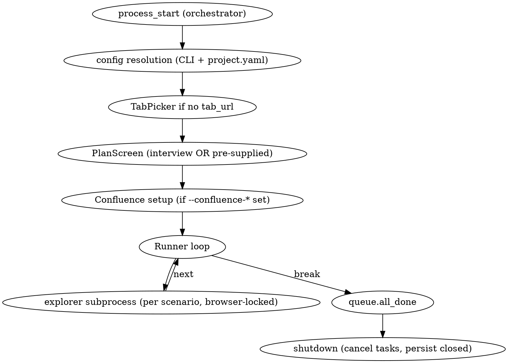

# Explorer — Specification

This document is the seed for building a Claude-powered exploratory testing
harness from scratch. It captures the **intent**, the **invariants**, the
**event model**, the **subprocess roles**, and the **lifecycle** — enough that
another team can re-implement it in a different language/stack/UI framework
without re-discovering the same lessons.

The reference implementation (Python + Textual + `claude` CLI subprocesses) is
at <https://github.com/Chibionos/explorer>. Treat that as one valid
realization, not as the spec itself.

---

## 1. Purpose

Build a **long-running TUI** that:

1. Drives **one real Chrome tab** that a human is already looking at.
2. Spawns Claude Code (or any agentic LLM CLI) subprocesses to **explore** that
   tab against a user-approved list of scenarios.
3. When the agent finds a bug, **files it to a Jira epic** with a screenshot
   *and* a code-aware fix suggestion (the bug-filer subagent reads the product
   codebase before filing).
4. Optionally maintains a **Confluence evidence page** that records every
   scenario tested, with screenshot paths and bug links.
5. Exposes **CLI subcommands** so any coding agent (not just the original
   operator) can start the harness, watch progress from outside the TUI, and
   course-correct (swap plan, restart a stuck explorer, change target tab).

The harness is for **exploratory** testing — surfacing UX/UI/functional bugs
that scripted tests don't catch — not for regression.

## 2. Non-Goals

- Not a replacement for Playwright/Cypress regression suites.
- Not a workflow execution engine (does not click "Run" / "Debug" on
  expensive operations unless the scenario explicitly says to).
- Not a multi-tenant service. One operator, one project, one tab.
- Not a headless cloud runner. It uses the operator's local Chrome.
- Not a code-fixing agent. It files tickets with fix suggestions; humans or
  downstream agents apply them.

## 3. Glossary

| Term | Meaning |
|------|---------|
| **Run** | One invocation of the explorer. Has a unique timestamped directory. |
| **Round** | One pass through the original scenario list. `--continuous` cycles rounds. |
| **Scenario** | A focused exploration goal with `id`, `title`, `goal`. |
| **Plan** | A YAML file of scenarios. |
| **Explorer subprocess** | One LLM CLI process executing exactly one scenario. |
| **Sub-agent** | An LLM CLI `Task` tool call inside an explorer. Used for bug-filer and scenario-proposer. |
| **Browser-harness** | The CLI that proxies CDP to the operator's Chrome. |
| **Event log** | The canonical JSONL stream of structured events for a run. |
| **Dedup index** | Title-normalized map of `{signature → jira_key}` for filed bugs. |

## 4. Architectural Invariants

These are the non-negotiable design rules. Violations cause real problems
(observed during reference build):

**I-1. One Chrome tab, serialized.** Only one explorer subprocess drives the
browser at a time. Enforce with an explicit lock (e.g. `asyncio.Lock`), not
"hope-they-don't-collide".

**I-2. The orchestrator never talks to Jira/Confluence/Browser directly.**
Everything LLM-mediated happens in subprocesses. The orchestrator's job is
queueing, locking, event muxing, persistence, and TUI rendering. This keeps
the orchestrator language-agnostic w.r.t. integrations.

**I-3. Two event channels, both required.**
1. **stream-json** from each LLM subprocess. Parse to get sub-agent nesting
   (Task tool calls) and **live action visibility** (every tool the agent
   uses).
2. **Sentinel JSONL** file (`$EXPLORER_EVENT_LOG`). The subprocess shell-appends
   structured records here. This is the **canonical** truth for
   `bug_observed`, `bug_filed`, `scenario_done`, `plan_ready`,
   `confluence_page_ready`, etc. Don't parse English from the LLM.

**I-4. `claude -p` (or equivalent print mode) is single-shot.** Don't design
an interactive interview that depends on stdin round-tripping with the LLM
CLI. Collect inputs locally (in the TUI), then make ONE LLM call with all
answers embedded.

**I-5. Aborts ≠ done.** A clean subprocess exit does **not** mean the scenario
completed. The scenario is `done` only if the subprocess wrote a
`scenario_done` event. Otherwise mark it `failed`.

**I-6. Boundary discipline.**
- TUI code reads state and the event bus. Never spawns subprocesses, never
  hits networks.
- Runner/integration code writes to the event bus and stdout. Never imports
  the TUI.
- Core state code is pure (no I/O except its own persistence mirror).
- Subprocess prompts live as plain markdown files. They are not f-strings
  inside source code.

**I-7. Persist to local disk per run.** Resume must be possible. Replay must
be possible. Audit must be possible. Hold no in-memory state that you can't
reconstruct from the run directory.

**I-8. Every CLI flag must work for an automation agent.** No flag should
require a human to set it. Sensible defaults; idempotent re-saves; `-y` /
`--continuous` / `--resume` / `--plan` together must be enough to fire and
forget.

**I-9. The user must be able to see what the agent is doing.** Every tool
call by the agent surfaces in the TUI's log strip AND in the scenario's
expandable timeline. No silent work.

**I-10. The user must be able to restart a stuck scenario without quitting.**
A header health indicator and a bound key (`r` in reference impl) for
SIGTERM-and-move-on are mandatory.

## 5. Process Model

```
┌─────────────────────────────────────────────────────────────────────┐
│  orchestrator process (single, hosts the TUI)                       │
│  ┌─────────────────────────────────────────────────────────────┐    │
│  │ State: EventBus, ScenarioQueue, BugStore, DedupIndex,        │   │
│  │        BrowserLock, RunPaths, ProjectConfig                  │   │
│  └─────────────────────────────────────────────────────────────┘    │
│  ┌──────────────────────────────────────────────────────────────┐   │
│  │ Subscriptions: persist_events, bug_filed, scenario_proposed, │   │
│  │   scenario_done, plan_ready, confluence_page_ready,          │   │
│  │   per-scenario screenshot tracking                           │   │
│  └──────────────────────────────────────────────────────────────┘   │
│  ┌─────────────────────────────────────────────────────────────┐    │
│  │ Runner loop:                                                │    │
│  │   while not queue.all_done() or --continuous:               │    │
│  │     scenario = queue.next_pending()                         │    │
│  │     async with browser_lock:                                │    │
│  │       rc = run_explorer(scenario, …)  → spawn LLM CLI       │    │
│  │     mark done if scenario_done emitted, else failed         │    │
│  └─────────────────────────────────────────────────────────────┘    │
└─────────────────────────────────────────────────────────────────────┘
            │ spawns (one at a time, browser-locked) ▼
            ┌──────────────────────────────────────────────────┐
            │  EXPLORER subprocess (LLM CLI in stream-json mode)│
            │  cwd = codebase                                  │
            │  env: EXPLORER_EVENT_LOG, SCREENSHOTS_DIR,       │
            │       BUG_FILER_PROMPT_PATH, PROPOSER_PROMPT_PATH│
            │  drives browser-harness via Bash                 │
            │  uses Task tool to spawn:                        │
            │    ├─ bug-filer (parallel, run_in_background)    │
            │    └─ scenario-proposer                          │
            └──────────────────────────────────────────────────┘

            ┌──────────────────────────────────────────────────┐
            │ AUXILIARY subprocesses (orchestrator spawns):    │
            │  - planner             (once, on first run)      │
            │  - confluence-setup    (once, at run start)      │
            │  - confluence-writer   (on every scenario_done)  │
            └──────────────────────────────────────────────────┘
```

**Constraints:**
- Browser lock wraps the entire `run_explorer` call. Sub-agents inside the
  explorer (e.g. parallel bug-filers) must finish before the explorer process
  exits and the lock releases.
- Bug-filers do **not** touch the browser. They only do code search + Jira.
- Confluence-writer runs after the lock releases (does not block next scenario).
- Auxiliary subprocesses don't need the browser lock; they have their own
  scope.

## 6. Event Model

All events have shape `{type: string, data: object}`. Two producers:

### From parsing LLM CLI stream-json

| Event | Trigger | Data |
|-------|---------|------|
| `process_start` | subprocess spawned | session_label, pid |
| `process_exit` | subprocess exited | session_label, returncode |
| `note` | assistant text block | session_label, text (≤400 chars) |
| `narrative` | same as `note` | session_label, text (≤200 chars, for tree) |
| `tool_action` | non-Task tool_use | session_label, tool_use_id, tool_name, summary |
| `subagent_start` | Task tool_use | session_label, tool_use_id, description, subagent_type |
| `subagent_end` | tool_result | session_label, tool_use_id, is_error |

`note` and `narrative` are intentionally duplicated so the **log strip** and
**sessions tree** are independently configurable (different truncation, etc.).

### From the sentinel JSONL (subprocess-written)

| Event | Producer | Required Data |
|-------|----------|---------------|
| `plan_ready` | planner | `scenarios: [{id, title, goal}, …]` |
| `scenario_start` | explorer | scenario_id, title |
| `scenario_done` | explorer | scenario_id |
| `bug_observed` | explorer | uuid, scenario_id, title, symptom, page_url, screenshot_path |
| `scenario_proposed` | scenario-proposer (Task child) | id, title, goal, parent_scenario_id |
| `bug_filed` | bug-filer (Task child) | uuid, jira_key, jira_url, title |
| `bug_dup_comment` | bug-filer | uuid, existing_key, comment_url |
| `bug_filed_failed` | bug-filer | uuid, error, prepared_body |
| `confluence_page_ready` | confluence-setup | page_id, url |
| `confluence_updated` | confluence-writer | page_id, scenario_id |
| `confluence_update_failed` | confluence-writer | scenario_id, error |
| `parse_error` | tailer | line, error |

The orchestrator subscribes via an in-process pub/sub (the **EventBus**) with
both type-specific and wildcard subscriptions. Subscribers can be:
- Synchronous mutators of state (e.g. add bug to BugStore on `bug_filed`).
- Async dispatchers (e.g. spawn confluence-writer on `scenario_done`).
- TUI widgets (rendering only).

The full event stream is also persisted to `events.jsonl` for replay/audit.

## 7. State Files (on disk)

```
.explorer/
├── project.yaml          # Persistent per-cwd config (CLI defaults)
└── runs/<YYYY-MM-DD_HH-MM-SS>/
    ├── plan.yaml         # Scenarios approved for this run
    ├── events.jsonl      # Every event the orchestrator observed
    ├── explorer_event_log.jsonl   # Sentinel JSONL written by subprocesses
    ├── bugs.json         # Mirror of bugs filed in this run
    └── screenshots/<uuid>.png
```

**`project.yaml` fields** (all optional after first run, can be overridden by flag):

```yaml
jira_project: AE             # required first-run
epic_key: AE-1546            # required first-run
codebase_path: /path/to/src  # required first-run
tab_url: https://app.tld/…   # optional; TUI picker fills it in
bu_name: null                # optional browser-harness daemon name
confluence_space: ENG        # optional, for per-run page creation
confluence_page: "12345"     # optional, for persistent-page appending
```

**`events.jsonl` is replayable.** Resume reads it to determine which scenarios
already emitted `scenario_done`.

## 8. Subprocess Roles (Prompts)

Each role is a markdown file. The orchestrator does template-substitution on
`{{PLACEHOLDERS}}` before passing to the LLM CLI.

### 8.1 Planner

**Inputs (substituted into prompt):** `{{ANSWERS}}` — a formatted block of
Q&A from the local TUI interview.

**Behavior:**
- Read the user's answers.
- Generate 5–20 scenarios (more if user said "thorough", fewer for "smoke").
- Append ONE JSON line to `$EXPLORER_EVENT_LOG`:
  `{"type": "plan_ready", "data": {"scenarios": [...]}}`
- Exit.

**Constraints:**
- Must NOT touch the browser.
- Must NOT file bugs.
- Single-shot; no stdin loop.

### 8.2 Explorer

**Inputs:** `{{SCENARIO_ID}}`, `{{SCENARIO_TITLE}}`, `{{SCENARIO_GOAL}}`,
`{{JIRA_PROJECT}}`, `{{EPIC_KEY}}`, `{{KNOWN_BUG_TITLES}}`, `{{TAB_URL}}`.
**Env:** `EXPLORER_EVENT_LOG`, `SCREENSHOTS_DIR`, `BUG_FILER_PROMPT_PATH`,
`PROPOSER_PROMPT_PATH`, `JIRA_PROJECT`, `EPIC_KEY`, optional `BU_NAME`.

**Behavior:**
1. Verify browser tab matches `{{TAB_URL}}` via `browser-harness -c
   'print(page_info())'`. If unrelated tab is focused, look across other open
   tabs (CDP `Target.getTargets`) and switch to a matching one. Only if no
   suitable tab exists, emit a `note` and exit.
2. Emit `scenario_start`.
3. Explore the scenario. Take screenshots. Click, type, refresh, mid-flow
   interrupt — whatever the goal calls for.
4. On observing a bug:
   - Save screenshot to `$SCREENSHOTS_DIR/<uuid>.png`.
   - Emit `bug_observed`.
   - Spawn a `Task` sub-agent with the bug-filer prompt
     (`$BUG_FILER_PROMPT_PATH`), substituting ALL placeholders including
     `{{KNOWN_BUG_TITLES}}` — verbatim copy from own prompt.
   - Pass `run_in_background=true` so exploration continues.
5. On observing an interesting unrelated flow: spawn a `Task` with the
   scenario-proposer prompt.
6. After 3–10 minutes of exploration OR exhausting obvious paths: emit
   `scenario_done` and exit. Pending Task children must finish before exit.

**Threshold for bug-filing:** broken / misleading / sloppy /
counter-intuitive. NOT taste preferences or feature requests.

### 8.3 Bug Filer (Task sub-agent)

**cwd:** the product codebase (inherited from explorer).
**Inputs:** `{{BUG_UUID}}`, `{{BUG_TITLE}}`, `{{BUG_SYMPTOM}}`, `{{PAGE_URL}}`,
`{{SCREENSHOT_PATH}}`, `{{JIRA_PROJECT}}`, `{{EPIC_KEY}}`,
`{{KNOWN_BUG_TITLES}}`.

**Behavior:**
1. Check `{{KNOWN_BUG_TITLES}}` for a near-match (signature dedup). If found:
   `mcp__atlassian__addCommentToJiraIssue` with fresh repro + screenshot
   path. Emit `bug_dup_comment`. Stop.
2. Otherwise: search the codebase with Grep/Read/Glob for the responsible
   file(s). Identify file:line range, root cause hypothesis, suggested fix.
3. `mcp__atlassian__createJiraIssue` with type=Bug, parent=epic, body
   containing: Symptom, Steps, Screenshot path, Suspected code (file:line +
   snippet), Suggested fix (3-6 sentences with exact identifiers), Labels.
4. Emit `bug_filed`. On failure: emit `bug_filed_failed` with the prepared
   body so it can be retried.

**Constraints:** Never touches the browser. Never runs new scenarios.

### 8.4 Scenario Proposer (Task sub-agent)

**Inputs:** `{{PARENT_SCENARIO_ID}}`, `{{OBSERVATION}}`.

**Behavior:** Emit 1–3 `scenario_proposed` events with new scenario ideas, then
exit.

### 8.5 Confluence Writer

**Inputs:** all scenario metadata, `{{BUGS_FILED}}` (list of "key — title"),
`{{SCREENSHOT_PATHS}}` (newline-joined), `{{RUN_DIR}}`, `{{TAB_URL}}`.

**Behavior:**
1. Fetch current page via `mcp__atlassian__getConfluencePage`.
2. Build a new markdown section (scenario title, status, goal, bugs with
   Jira links, screenshot file paths).
3. `mcp__atlassian__updateConfluencePage` with body = old body + new section
   (append, never replace).
4. Emit `confluence_updated` or `confluence_update_failed`.

## 9. TUI Contract

The reference TUI uses Textual. Other implementations (Bubble Tea, Ink) can
substitute, but must preserve the following **contract**:

### 9.1 Layout

```
┌─ header (1 line) ───────────────────────────────────────────────────┐
│ explorer ─ Bugs:N │ Pending:N │ Discovered:N │ <health> │ Jira:X/Y │ Code:Z │
├─ sessions pane (50%) ──────────┬─ bugs pane (50%) ──────────────────┤
│ Tree of scenarios + children   │ ListView of filed bugs, newest first│
│ (see §9.3)                     │ <KEY>  <title>                     │
│                                │                                    │
├────────────────────────────────┴────────────────────────────────────┤
│ log strip (≥8 lines, expandable to 20)                              │
│ Live tool-call feed across all sessions                             │
└─────────────────────────────────────────────────────────────────────┘
```

### 9.2 Keybindings (mandatory)

| Key | Action |
|-----|--------|
| `q` | Quit |
| `e` | Toggle log strip between compact and expanded |
| `t` | Open tab picker (mid-run; affects next scenario) |
| `r` | SIGTERM current explorer subprocess; runner moves to next scenario |

### 9.3 Sessions Tree

Each session is a **collapsible** top-level node:
```
⏵ explorer-3 — <scenario title>          (running)
✓ explorer-3 — <scenario title>          (done)
✗ explorer-3 — <scenario title>          (failed / aborted)
```

When expanded, children are a **chronological timeline** of leaves. Every
event with a `session_label` field that maps to this session is rendered as
a leaf, in arrival order:

```
▶  start: <scenario_id>
📝 <agent narrative text, ≤160 chars>
🌐 browser-harness -c '...'
📄 Read <path>
🔍 Grep <pattern>
✏️  Write <path>
📋 createJiraIssue: <title>
⏵ Task — <description>                   (sub-agent, collapsible)
  ✓ Task — <description>
‼  observed: <bug title>
→  filed: AE-1234 <title>
📋 confluence: <page_id>
✓  done: <scenario_id>
```

Sessions start **collapsed** so the tree stays scannable. Expansion is on
demand.

### 9.4 Header Health Field

Updates once per second from a `_last_activity_at[session_label]` map. Three
states:

- `⏵ active <label> (Ns)` — last activity within 30 s
- `⏳ slow <label> (Ns idle)` — > 30 s
- `⚠ STUCK <label> (Ns idle — press r to restart)` — > 90 s

When no explorer is active: `idle (no explorer)`.

### 9.5 Plan Approval Screen

Pre-run modal. Two paths:

- **Interactive interview** (no `--plan`): asks 4 hardcoded questions one at
  a time, collects answers, dispatches the planner subprocess, then renders
  the resulting plan for approval with `y`.
- **Pre-supplied plan** (`--plan path.yaml`): shows the plan immediately;
  `y` to approve, `q` to quit. `--yes` auto-approves.

### 9.6 Tab Picker Screen

Lists every real Chrome tab (filters out `chrome://`, `devtools://`,
`chrome-extension://`). Arrow keys + Enter to select. Pops automatically on
startup if no `tab_url` is configured, or via `t` keybind, or via
`--pick-tab` flag.

## 10. CLI Contract

### 10.1 `explorer` (default — launch TUI)

| Flag | Purpose | Required |
|------|---------|----------|
| `--jira-project KEY` | Jira project for bug filing | first run |
| `--epic KEY` | Jira epic key | first run |
| `--codebase PATH` | Product source tree path | first run |
| `--tab-url URL` | Target tab; if omitted, TUI picker pops | no |
| `--bu-name NAME` | browser-harness daemon name | no |
| `--plan PATH` | YAML scenarios file | no |
| `-y / --yes` | Auto-approve plan | no |
| `--continuous` | Cycle rounds; press q to stop | no |
| `--resume [PATH\|"latest"]` | Continue a previous run | no |
| `--pick-tab` | Force tab picker | no |
| `--confluence-space KEY` | Create page per run | no |
| `--confluence-page ID` | Append to existing page | no |

### 10.2 `explorer status`

One-shot summary of current/latest run. Designed for coding agents.

```
explorer status [--run-dir PATH] [--json] [--last N]
```

Must report:
- run dir path
- running PIDs by session_label
- bug count + list (jira_key, title, url)
- scenarios done / in progress
- last N events with friendly formatting

`--json` mode returns machine-parseable JSON.

### 10.3 `explorer tail`

Streams `events.jsonl` with friendly emoji formatting.

```
explorer tail [--run-dir PATH] [--from-start] [--filter TYPE]
```

`--filter` narrows to events whose type contains the given substring.

### 10.4 Subcommand routing

`explorer status …` and `explorer tail …` are non-TUI helpers; `explorer …`
(no subcommand) launches the TUI. `explorer run …` is an explicit alias for
the TUI form.

## 11. Configuration Lifecycle

1. **First run in a cwd**: required flags must be set on the CLI. The
   orchestrator writes `.explorer/project.yaml`.
2. **Subsequent runs from same cwd**: any flag omitted falls back to
   `project.yaml`. Any flag provided overrides AND persists.
3. **Different cwd = different project**. State directories are per-cwd.
   This is a feature: separate projects don't collide.

## 12. Run Lifecycle



## 13. Resume Semantics

`--resume [PATH | "latest"]` does:

1. Pick the run dir (latest under `.explorer/runs/` by default).
2. Reuse the run dir — new events append to existing `events.jsonl`. Audit
   trail stays continuous.
3. Load `plan.yaml` from the run dir → populate queue.
4. Replay `events.jsonl` to find every `scenario_done` event → mark those
   queue entries as `done`.
5. Load `bugs.json` → BugStore. Seed DedupIndex from `(title → jira_key)`
   pairs so re-discoveries become comments.
6. Skip planner + interview entirely. Auto-approve the plan screen.

**Mutually exclusive** with `--plan` (resume reuses the prior plan).

## 14. Continuous Mode

`--continuous`:
- Snapshot the original scenario list at startup.
- When `queue.all_done()`, bump round counter, re-propose every original
  scenario with `id = <orig_id>-r<N>` and `title = "[round N] <orig title>"`.
- Loop until user presses `q`.

Dedup is round-aware: a bug rediscovered in round 2 gets a comment on round
1's issue (signature dedup is on normalized title, not id).

## 15. Health and Restart

The orchestrator keeps a per-session-label `last_activity_at` timestamp,
updated on every event with a `session_label` field.

The TUI header reads this and classifies:
- `< 30 s` → active
- `30–90 s` → slow
- `> 90 s` → STUCK (advice: press `r`)

Pressing `r` calls `proc_holder.terminate()` on the live explorer subprocess.
The runner loop sees the non-zero exit, marks the scenario `failed`, and
moves on. The user can then `--resume` later if they want to retry that
specific scenario.

## 16. Integrations

### 16.1 Browser (browser-harness)

- The orchestrator NEVER calls browser-harness directly. The explorer agent
  shells out to `browser-harness -c '<python>'` via Bash.
- The exception is the **tab picker**, which lists open tabs via
  `browser-harness -c 'cdp("Target.getTargets")'`. This is read-only.
- Browser lock is at the **scenario** granularity, not the action
  granularity. The explorer keeps the tab for its entire lifetime.

### 16.2 Jira

- All Jira calls are MCP-mediated (`mcp__atlassian__createJiraIssue`,
  `mcp__atlassian__addCommentToJiraIssue`) inside the bug-filer subprocess.
- The orchestrator only knows the project key + epic key; it never holds
  Jira credentials.
- Screenshots referenced by file path in the issue body (no attachment
  upload in v1).

### 16.3 Confluence

- Optional. Activated by `--confluence-space` (create per run) or
  `--confluence-page` (append to existing).
- Setup at run start (create or verify-existing). On `confluence_page_ready`,
  the orchestrator persists the page ID to `project.yaml` so subsequent runs
  default to it.
- Per-scenario writer dispatched after each `scenario_done`. Reads current
  page, appends a new section, writes.

### 16.4 LLM CLI

- The agent driver is the LLM CLI in **single-shot print mode** with
  stream-json output (`claude --output-format stream-json -p <prompt>` in
  the reference). Multi-turn interactive mode is **not** used — see I-4.
- Required CLI capabilities:
  - `--output-format stream-json` (or equivalent) emitting per-turn
    `assistant` / `user` / `result` events.
  - A `Task` tool that spawns sub-agents with their own prompt and supports
    `run_in_background=true`.
  - File-system tools (Read, Grep, Glob, Bash, Write, Edit).
  - MCP support so Jira/Confluence are inherited from the user's config.

## 17. Failure Modes

| Failure | Detection | Response |
|---------|-----------|----------|
| Explorer subprocess crashes | non-zero exit before `scenario_done` | mark `failed`; ✗ in tree |
| browser-harness daemon hangs | Bash timeout inside agent | agent emits `note`, exits; mark `failed` |
| Wrong tab focused | agent verifies `page_info()` mismatch | look across tabs, switch, or emit note + exit |
| Jira/MCP fails | tool_result with `is_error` true | bug-filer emits `bug_filed_failed`; orchestrator queues for retry (v1.1) |
| Confluence update fails | writer emits `confluence_update_failed` | logged; scenario marked done anyway (Confluence is non-blocking) |
| Two bugs are same | dedup index hit | comment on existing, emit `bug_dup_comment` |
| JSONL torn write | parser fails on a line | skip line, emit `parse_error` event |
| Stuck (no activity > 90 s) | health timer | user presses `r` → SIGTERM → runner moves on |
| Orchestrator killed | n/a | `events.jsonl` + `bugs.json` preserved on disk; `--resume` recovers state |

## 18. Testing Strategy

Three layers:

1. **Unit tests** for core state modules (queue, store, dedup, event bus,
   locks). These are pure Python (or whatever language). Aim for full branch
   coverage. The reference impl has 55 such tests.

2. **Runner tests** with a fake subprocess. Pre-recorded `stream-json` lines
   feed into `parse_stream_line` (or equivalent); assert the right events
   come out. No real LLM CLI needed in CI.

3. **E2E smoke** (manual, not CI). FastAPI Jira mock + tiny canned HTML
   served locally + real `browser-harness` + real LLM CLI. Verifies plan
   approval → at least one bug filed → TUI doesn't crash.

**TUI rendering itself is not unit-tested.** Snapshot tests of nested
reactive trees are flaky. Keep widgets dumb (render from state) so unit
tests of the state are sufficient.

## 19. What's Deliberately NOT in v1

- Inline image embedding in Confluence (paths only).
- Video / screencast recording (filmstrip is on the roadmap).
- Automatic retry of `bug_filed_failed` events.
- Pre-flight Jira/Confluence permission checks.
- Screenshot PII redaction.
- Time / bug budgets (`--max-bugs`, `--time-cap`).
- Multi-tenant / multi-project parallel runs.
- A scheduler. The runner is sequential; concurrency is at sub-agent level
  inside the explorer only.

## 20. Suggested Build Order (for a fresh implementer)

If you're building this from scratch, this order minimizes rework:

1. **Pure state modules** (queue, store, dedup, event bus, lock, run paths,
   project YAML). TDD everything; they're cheap.
2. **CLI parser** + `project.yaml` persistence (no subcommands yet).
3. **stream-json parser**. Get this right BEFORE building the runner — it's
   the integration risk. Validate the field shape against an actual LLM CLI
   invocation; don't trust documentation.
4. **JSONL tailer** for the sentinel event log.
5. **Subprocess prompt markdown files**. Author them in the dumbest form
   that works; iterate based on real LLM output.
6. **`run_claude` + `run_explorer` drivers**. Now you have an end-to-end
   one-scenario pipeline.
7. **TUI skeleton** (header + log strip + placeholders). Just enough to
   render events.
8. **Sessions tree + bugs pane**. Wire to the event bus.
9. **Plan approval screen** (with the local-questions design — avoid the
   stdin-loop trap).
10. **Orchestration loop**: queue + browser lock + per-scenario runner.
11. **Resume** (replay events.jsonl, seed dedup from bugs.json).
12. **Continuous mode**.
13. **Tab picker**.
14. **Health timer + restart binding**.
15. **Confluence integration**.
16. **`status` and `tail` subcommands**.

By step 10 you have a working harness. Everything after that is polish that
makes it production-grade for unattended operation.

---

## Appendix A — Reference Event Shapes

```jsonc
// plan_ready
{"type": "plan_ready", "data": {
  "scenarios": [
    {"id": "save-flow", "title": "...", "goal": "..."}
  ]
}}

// scenario_start
{"type": "scenario_start", "data": {
  "scenario_id": "save-flow", "title": "Saving a flow"
}}

// bug_observed
{"type": "bug_observed", "data": {
  "uuid": "u-1", "scenario_id": "save-flow",
  "title": "Save button stays disabled after a valid edit",
  "symptom": "...", "page_url": "https://…",
  "screenshot_path": "/abs/path/u-1.png"
}}

// bug_filed
{"type": "bug_filed", "data": {
  "uuid": "u-1", "jira_key": "AE-1234",
  "jira_url": "https://uipath.atlassian.net/browse/AE-1234",
  "title": "Save button stays disabled after a valid edit"
}}

// scenario_done
{"type": "scenario_done", "data": {
  "scenario_id": "save-flow", "bugs_observed": 1
}}

// confluence_page_ready
{"type": "confluence_page_ready", "data": {
  "page_id": "12345", "url": "https://…"
}}

// confluence_updated
{"type": "confluence_updated", "data": {
  "page_id": "12345", "scenario_id": "save-flow"
}}
```

## Appendix B — Lessons Learned

These came up while building the reference. Capturing them so the next builder
doesn't have to rediscover.

1. **`claude -p` is single-shot.** Designs that pipe user answers into a long-
   running interactive subprocess will appear to work for ~one question, then
   the subprocess exits and stdin writes go to a closed pipe. Do the
   interview locally in the TUI, then make ONE LLM call.

2. **Don't shadow Textual's internal attributes.** `_nodes`, `_listener`,
   etc. are used by Textual's base classes. Prefix your own state with the
   widget's role (e.g. `_session_nodes`, not `_nodes`).

3. **`push_screen_wait` requires a worker context.** Wrap it in a
   `@work`-decorated method (or equivalent in your framework). Calling from
   `on_mount` directly fails.

4. **`dismiss(("approved", x))` from inside `on_mount` is illegal.** Use a
   short timer / `call_after_refresh` to defer one tick.

5. **Setting `widget.id = "..."` after construction may raise** in newer
   Textual versions. Pass `id=` to the constructor.

6. **`proc.returncode or -1` is wrong.** `0 or -1 == -1` because Python
   treats 0 as falsy. Use `proc.returncode if proc.returncode is not None else -1`.

7. **Template substitution is a hidden contract.** When the explorer
   dispatches a Task sub-agent with another prompt, every placeholder in the
   inner prompt must be substituted by the explorer. Easy to forget — codify
   in the explorer's prompt with an explicit checklist of placeholders.

8. **The browser tab may not be where the user said.** Verify with
   `page_info()` and, if needed, look at `Target.getTargets` for a matching
   tab before bailing. Real users keep multiple tabs open.

9. **The orchestrator's runner loop must not assume `process_exit` == done.**
   The agent might exit cleanly after deciding the scenario was on the wrong
   page. Use `scenario_done` events as the source of truth, not exit codes.

10. **A 1-line log strip is too small.** 8 lines is the sweet spot — enough
    to read the agent's recent reasoning without dominating the view.
    Expandable to 20 for debugging.

11. **Wildcards in the subscribe API are essential.** Without `*` the UI has
    to subscribe to ~12 event types. With it, one wildcard handler routes
    everything cleanly.

12. **State files matter more than you think.** `events.jsonl`, `bugs.json`,
    and `plan.yaml` are the *contract* between a run and any tool that wants
    to inspect/resume/audit it (including the `status` / `tail` subcommands
    and other coding agents). Define their shapes early; don't change them
    lightly.

13. **Header carries information density.** Every glance should answer: how
    many bugs filed, how many scenarios left, is something stuck, where are
    we filing, what code is being analyzed. Cramming this into one line is a
    feature, not a constraint.

14. **Tool calls are the story.** Surfacing every Bash / Read / Grep / MCP
    call into the timeline turns the TUI from "spinner that says something
    is happening" into "documentation of what was done". Users notice this.
